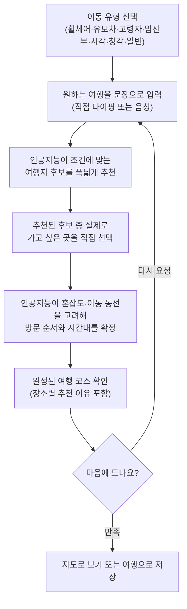
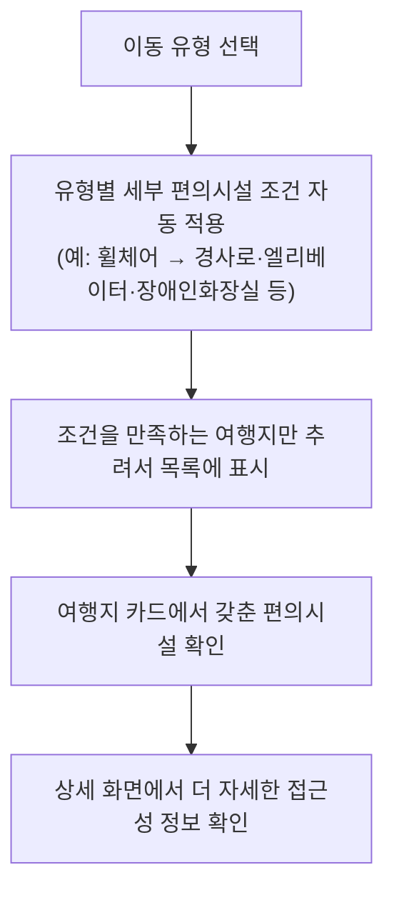
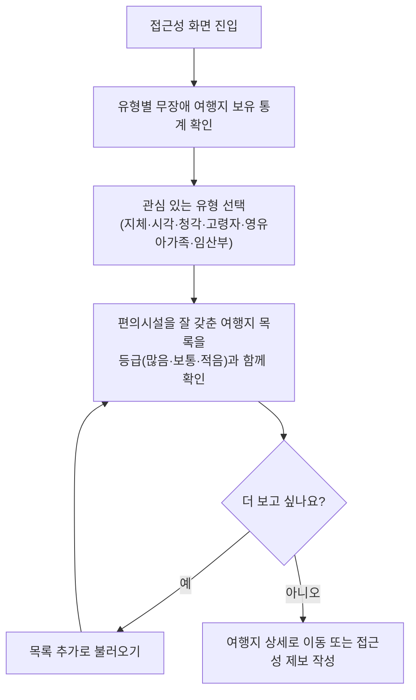
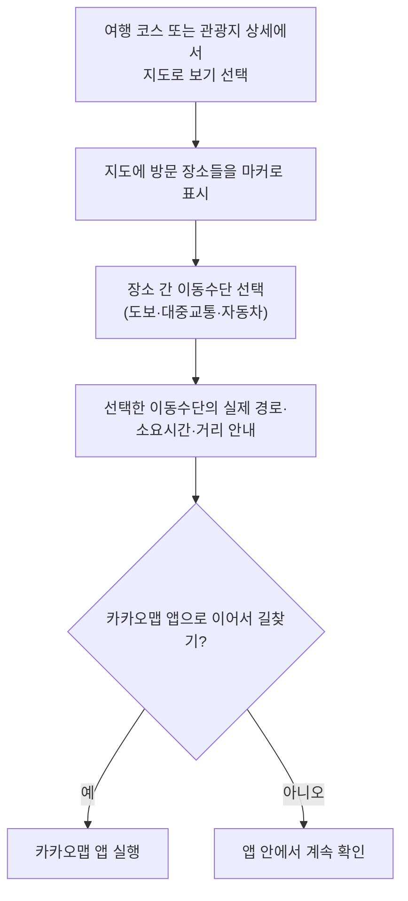
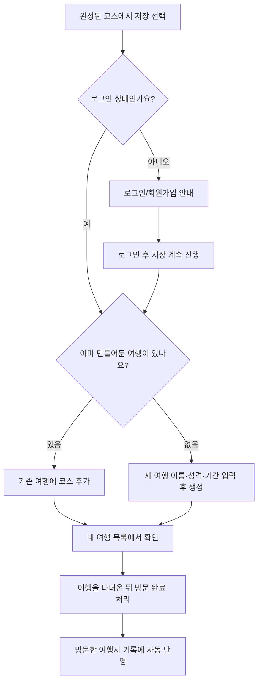
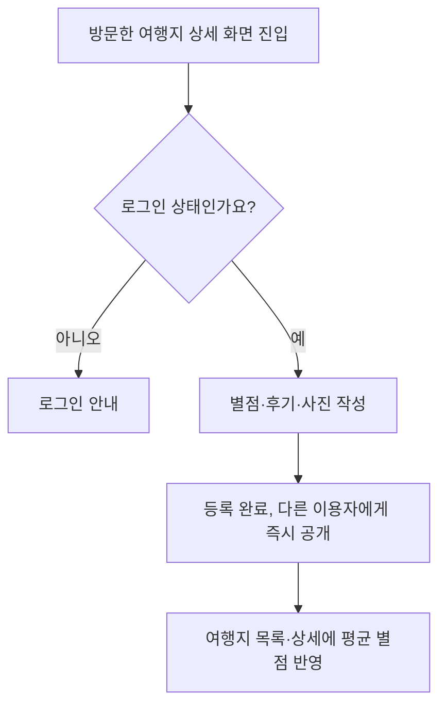
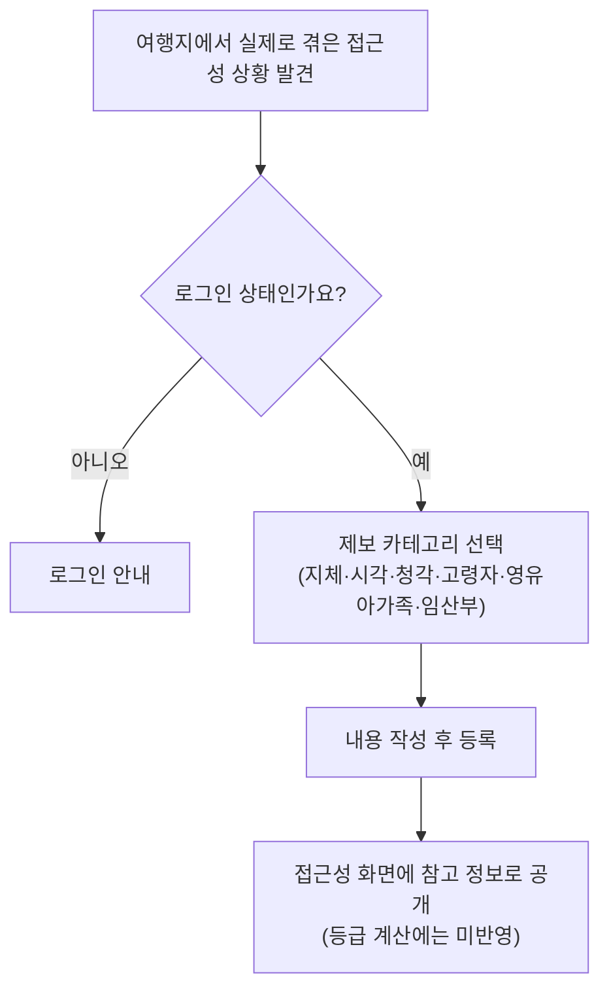
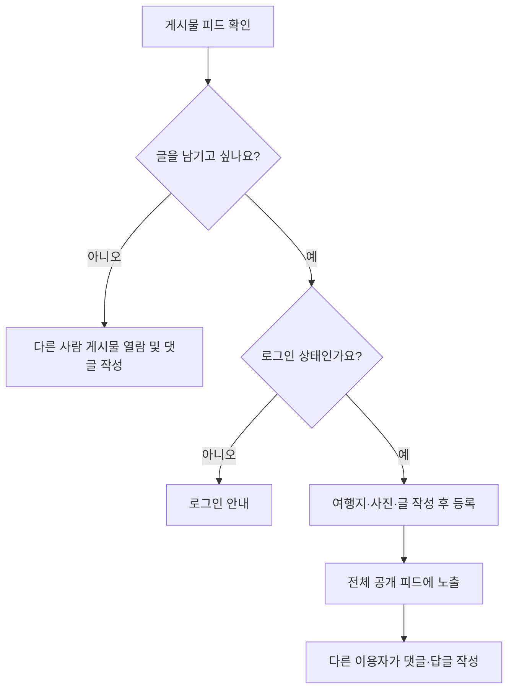
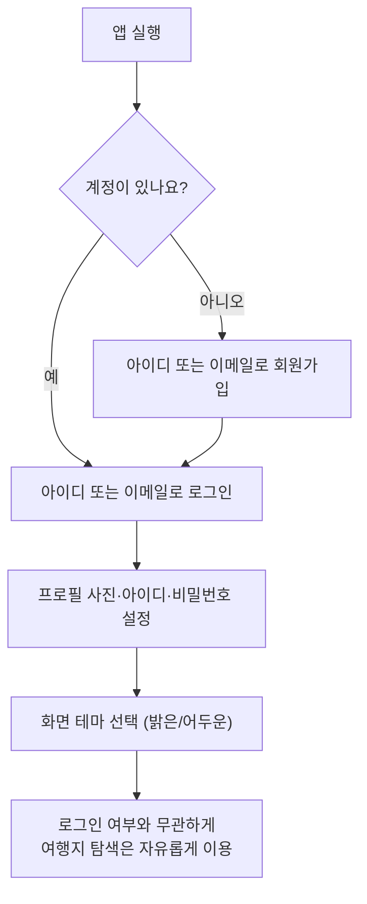
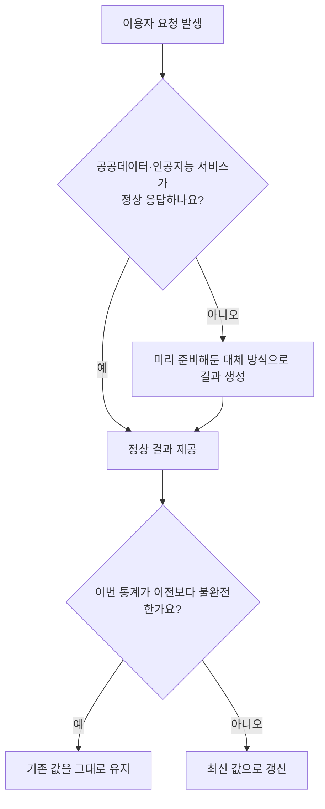

# 경기포올 기능 설명서

## 1. 서비스 소개

'경기포올'은 휠체어를 이용하는 지체장애인, 유모차를 동반한 가족, 고령자, 임산부, 시각장애인, 청각장애인 등 여행에서 이동과 편의시설 제약을 겪기 쉬운 '관광약자'를 위한 인공지능 기반 여행 코스 추천 서비스입니다.

기존의 여행 정보는 대부분 비장애인 기준으로 만들어져 있어, 관광약자들은 여행지를 고를 때마다 "이곳에 경사로가 있을까", "휠체어로 화장실을 이용할 수 있을까", "유모차를 끌고 다닐 만한 길일까" 같은 질문에 스스로 일일이 답을 찾아야 하는 부담을 안고 있습니다. 경기포올은 이 부담을 줄이기 위해, 공공기관이 제공하는 관광지 정보에 실제 편의시설 정보를 결합하고, 여기에 인공지능을 더해 이용자의 상황에 딱 맞는 여행 코스를 자동으로 만들어주는 서비스입니다. 현재는 경기도 전역의 관광지를 대상으로 서비스하고 있으며, iOS·안드로이드 스마트폰 앱과 웹 브라우저 양쪽에서 동일하게 이용할 수 있습니다.

## 2. 서비스가 필요한 이유

관광약자는 인구 비중이 결코 작지 않음에도, 여행 준비 과정에서 필요한 정보(경사로 유무, 장애인 화장실 위치, 유모차 이동 가능 여부, 점자·음성 안내 여부, 혼잡한 시간대 등)를 한 곳에서 확인하기 어렵습니다. 정보가 있어도 여러 사이트에 흩어져 있거나, 실제 방문자의 생생한 후기가 부족해 신뢰하기 어려운 경우가 많습니다. 경기포올은 이런 정보를 한 화면에 모으고, 여기에 자연스러운 대화형 요청만으로 나만의 여행 코스를 완성해주는 방식으로 이 문제를 해결하고자 합니다.

## 3. 주요 기능

### 3.1 인공지능 맞춤형 여행 코스 추천

서비스의 핵심 기능입니다. 사용자는 먼저 자신의 이동 유형(휠체어 이용, 유모차 동반, 고령자, 임산부, 시각장애, 청각장애, 특별한 제약 없음의 일곱 가지 중 하나)을 선택합니다. 그다음 "경사 없는 산책로와 맛집을 추천해줘"처럼 원하는 여행을 자연스러운 문장으로 입력하면 됩니다. 문장은 직접 타이핑하거나, 마이크 버튼을 눌러 음성으로 말하면 자동으로 글자로 바뀌어 들어갑니다.

요청을 보내면 인공지능이 그 이동 유형에 실제로 도움이 되는 편의시설을 갖춘 장소들 위주로 폭넓게 후보를 추천합니다. 사용자는 추천된 장소들을 살펴보고 실제로 가고 싶은 곳만 체크박스로 직접 골라낼 수 있습니다. 마지막으로 선택을 확정하면, 인공지능이 그 장소들을 대상으로 혼잡한 시간대는 피하고 이동 동선이 자연스럽도록 방문 순서와 예상 도착 시각까지 정리한 완성된 여행 코스를 만들어줍니다. 각 장소마다 "왜 이 장소, 이 시간에 방문하면 좋은지"에 대한 설명도 함께 제시되는데, 이 설명은 실제로 그 장소가 갖춘 편의시설(예: 경사로, 점자블록, 수화 안내 등)을 근거로 하여, 이용자 유형과 무관한 내용은 언급하지 않도록 세심하게 설계되어 있습니다.

만약 인공지능 서비스가 일시적으로 응답하지 않거나 요청이 몰려 지연되는 상황이 생기더라도, 자동으로 대체 로직이 동작해 혼잡도가 낮은 시간대를 우선 배치하는 방식으로 코스를 완성해주기 때문에 사용자는 서비스가 멈췄다는 느낌 없이 계속 이용할 수 있습니다.

### 3.2 세밀한 무장애(접근성) 정보 필터링

경기포올이 다루는 접근성 정보는 단순히 "장애인 편의시설 있음/없음" 수준이 아니라 이용자 유형별로 세분화되어 있습니다.

- 지체장애(휠체어 이용자): 경사로, 엘리베이터, 장애인 화장실, 휠체어 대여, 주차 공간, 출입통로 등 여섯 가지 항목
- 시각장애: 점자블록, 보조견 동반 가능 여부, 안내요원 배치, 오디오가이드, 큰 활자 홍보물, 점자 홍보물, 유도 안내설비 등 일곱 가지 항목
- 청각장애: 수화 안내, 자막이 나오는 비디오가이드, 청각장애인 편의시설을 갖춘 객실 등 세 가지 항목
- 영유아 동반 가족: 유모차로 이동 가능한 동선, 수유실, 유아용 보조의자 등 세 가지 항목
- 임산부: 수유실, 유아용 의자, 경사로, 엘리베이터, 화장실 등 다섯 가지 항목

이용자가 유형을 선택하면, 여행 코스 추천이나 여행지 목록 조회 모두 이 세부 항목을 기준으로 실제로 도움이 되는 장소만 걸러서 보여줍니다.

### 3.3 접근성 통계와 유형별 추천 여행지

앱에는 '접근성'이라는 별도의 화면이 있어, 앞서 말한 여섯 개 이용자 유형별로 경기도 안에 무장애 여행지가 각각 몇 곳이나 있는지를 한눈에 통계로 볼 수 있습니다. 유형 하나를 선택하면 그 유형에 편의시설을 특히 잘 갖춘 여행지들을 "많음·보통·적음" 세 단계 등급과 함께 목록으로 보여주고, 필요하면 이어서 더 많은 여행지를 불러올 수 있습니다. 각 여행지 카드에는 실제로 어떤 편의시설을 갖추고 있는지가 구체적으로 표시되며, 시각장애가 있는 사용자도 화면읽기 기능만으로 핵심 정보를 빠르게 파악할 수 있도록 문구를 간결하게 구성했습니다.

### 3.4 실제 도로 기반 지도와 길찾기

여행 코스가 만들어지면 지도 화면에서 코스에 포함된 모든 장소를 한눈에 확인할 수 있습니다. 장소와 장소 사이를 이동할 때는 도보, 대중교통, 자동차 세 가지 이동수단 중 원하는 방식을 선택할 수 있고, 그에 맞춰 실제 도로와 보행로, 대중교통 노선을 반영한 경로와 예상 소요시간·이동거리를 안내해줍니다. 지도 화면에서 곧바로 카카오맵 앱으로 넘어가 실제 길찾기 안내를 이어서 받을 수도 있습니다. 관광지 상세 화면에서는 현재 내 위치를 기준으로 그 장소까지 이동수단별 예상 소요시간을 미리 비교해볼 수도 있습니다.

### 3.5 나만의 여행 만들기와 관리 ("내 여행")

완성된 여행 코스는 '여행'이라는 단위로 저장해 나중에 다시 꺼내볼 수 있습니다. 하나의 여행에는 이름과 성격(가족·커플·친구·혼자 등, 자유롭게 직접 입력도 가능), 여행 기간을 지정할 수 있고, 그 안에 여러 개의 코스(예: 1일차, 2일차)를 함께 담을 수 있습니다. 저장된 코스 안에서 방문 순서를 손가락으로 끌어서 다시 배치할 수도 있고, 제목을 바꿀 수도 있습니다.

여행을 다녀온 뒤에는 '방문 완료' 버튼 하나로 그 여행에 담긴 모든 장소를 한 번에 '방문한 여행지' 기록으로 남길 수 있고, 필요하면 방문 날짜를 나중에 수정할 수도 있습니다. '내 여행' 화면 상단에는 지금까지 저장한 경로, 작성한 리뷰, 남긴 접근성 제보, 방문한 여행지 개수가 실시간으로 표시되어, 내가 이 서비스를 얼마나 활용했는지 한눈에 확인할 수 있습니다.

### 3.6 방문자 리뷰

실제로 다녀온 장소에 대해 별점(5점 만점)과 짧은 후기, 사진(최대 5장)을 남길 수 있습니다. 다른 이용자들이 남긴 리뷰와 평균 별점은 여행지 목록과 상세 화면 어디에서나 함께 확인할 수 있어, 인공지능 추천뿐 아니라 실제 방문자들의 생생한 경험도 참고해 여행지를 고를 수 있습니다.

### 3.7 접근성 제보 — 이용자가 함께 만들어가는 정보

공공기관이 제공하는 정보만으로는 미처 담기지 못한 실제 접근성 상황이 있을 수 있습니다. 경기포올은 이용자가 직접 "이 장소는 실제로 이랬어요"라고 제보할 수 있는 기능을 마련해두었습니다. 제보는 지체장애·시각장애·청각장애·고령자·영유아 동반 가족·임산부의 여섯 개 항목으로 나뉘어 있고, 시설 상황은 시간이 지나며 바뀔 수 있기 때문에 같은 장소에 여러 번 제보를 남길 수 있도록 했습니다. 다만 악의적인 제보로 접근성 평가가 왜곡되지 않도록, 제보 내용은 통계나 등급 계산에는 직접 반영하지 않고 참고 정보로만 별도로 보여줍니다.

### 3.8 여행 기록 공유 커뮤니티

다녀온 여행지에 대한 사진과 글을 자유롭게 남기고 다른 이용자들과 공유할 수 있는 공개 게시판 기능입니다. 다른 사람의 게시물에는 댓글을 달거나 댓글에 답글을 남기며 소통할 수 있고, 특정 여행지의 상세 화면에서는 그 장소에 대해 올라온 게시물만 모아서 볼 수도 있습니다.

### 3.9 계정과 개인화

아이디 또는 이메일로 간편하게 회원가입·로그인할 수 있고, 프로필 사진과 아이디, 비밀번호를 언제든 변경할 수 있습니다. 화면은 밝은 테마와 어두운 테마 중 원하는 대로 선택해 사용할 수 있습니다. 무엇보다, 여행지를 탐색하고 코스를 만들어보는 핵심 기능은 로그인하지 않아도 자유롭게 이용할 수 있으며, 코스를 저장하거나 리뷰·제보·게시물을 남기는 등 나의 기록을 남기는 순간에만 로그인을 안내합니다.

### 3.10 끊김 없는 서비스 운영을 위한 배려

관광 정보를 제공하는 공공데이터나 인공지능 서비스는 특성상 일시적으로 응답이 느려지거나 오류가 발생할 수 있습니다. 경기포올은 이런 상황에서도 이용자가 서비스 장애를 체감하지 않도록, 외부 정보를 미리 정리해두었다가 빠르게 보여주는 방식과, 문제가 생겼을 때 자동으로 대체 방법으로 결과를 만들어내는 방식을 함께 사용합니다. 또한 한 번 집계된 접근성 통계가 일시적인 오류로 실제보다 훨씬 나쁘게(예: 무장애 여행지 수가 갑자기 크게 줄어드는 등) 보이는 일이 없도록, 새로 계산한 값이 이전보다 명백히 불완전하다고 판단되면 그 값을 반영하지 않고 기존의 정상적인 값을 그대로 유지하는 안전장치도 마련해두었습니다. 앱을 다시 열었을 때 곧바로 이전에 보던 화면 내용을 먼저 보여주고 최신 정보로 조용히 갱신하는 방식도 함께 적용해, 네트워크 상태가 좋지 않은 순간에도 화면이 비어 보이지 않도록 했습니다.

## 4. 핵심 기능별 흐름도

각 기능이 실제로 어떤 순서로 동작하는지를 흐름도로 정리했습니다. (3장의 기능 설명과 번호가 그대로 대응합니다.)

### 4.1 인공지능 맞춤형 여행 코스 추천

### 4.2 세밀한 무장애(접근성) 정보 필터링

### 4.3 접근성 통계와 유형별 추천 여행지

### 4.4 실제 도로 기반 지도와 길찾기

### 4.5 나만의 여행 만들기와 관리 ("내 여행")

### 4.6 방문자 리뷰

### 4.7 접근성 제보

### 4.8 여행 기록 공유 커뮤니티

### 4.9 계정과 개인화

### 4.10 끊김 없는 서비스 운영을 위한 배려

## 5. 서비스의 차별점

- **뭉뚱그리지 않은 접근성 정보**: '장애인 편의시설'이라는 하나의 카테고리로 뭉뚱그리지 않고, 지체·시각·청각·고령자·영유아가족·임산부 여섯 유형별로 실제 필요한 편의시설을 따로 구분해 안내합니다.
- **대화하듯 요청하는 여행 코스**: 조건을 하나하나 검색하고 고르는 대신, 원하는 여행을 말이나 글로 편하게 요청하면 인공지능이 이해하고 그 이유까지 설명해주는 코스를 만들어줍니다.
- **공공데이터와 실사용자 경험의 결합**: 공공기관의 공식 정보에 실제 방문자의 리뷰와 제보를 더해, 시간이 지날수록 더 정확하고 믿을 수 있는 정보로 발전하는 구조를 갖추고 있습니다.
- **추천에서 길찾기까지 한 번에**: 여행지 추천, 코스 구성, 실제 길찾기, 저장과 기록까지 하나의 서비스 안에서 끊김 없이 이어집니다.

## 6. 향후 발전 방향

- 서비스 지역을 경기도에서 전국 단위로 확대
- 저장한 여행 일정에 맞춘 알림 기능 제공
- 회원가입 시 이메일 인증 절차 도입 등 계정 보안 강화

---
*본 문서는 실제 구현된 기능을 기준으로 작성되었습니다.*
